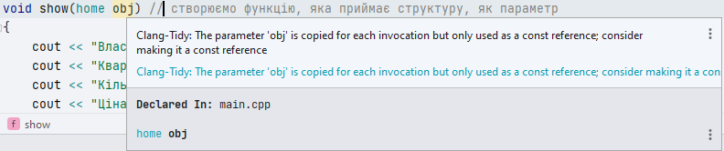

= Лабораторна робота № 4

== Структури (C/С&#43;&#43;) - Data Classes (Kotlin)

*Мета роботи:* отримати навички створення та реалізації програм, що використовують структури (data class)

=== Загальні відомості C&#43;&#43;

Структура – це об'єднання різних змінних (навіть з різними типами даних), якому можна присвоїти ім'я. Наприклад можна об'єднати дані про об'єкт Будинок: місто (в якому будинок знаходиться), вулиця, кількість квартир, інтернет(проведено чи ні) і т.д. в одній структурі. Загалом, можна зібрати в одну сукупність дані про все, що завгодно, точніше про все, що необхідно конкретному програмісту.

Розглянемо простий приклад, який допоможе познайомитися зі структурами і покаже, як з ними працювати. У цій програмі ми створимо структуру, створимо об'єкт структури, заповнимо значеннями елементи структури (дані про об'єкт) і виведемо ці значення на екран.

[source, c++]
----
#include <string>
#include <iostream>

using namespace std;

struct home     // Створюємо структуру
{
    string owner;      // тут зберігатиметься ім'я власника
    string city;       // назва міста
    int amountRooms;   // кількість кімнат
    double price;       // ціна
};

int main()
{

    home apartment1;   // об'єкт структури з типом даних, іменем структури home

    apartment1.owner = "Сєня"; // заповнюємо дані про власника і т.д.
    apartment1.city = "Миколаїв";
    apartment1.amountRooms = 5;
    apartment1.price = 150000;

    cout << "Власник квартири: " << apartment1.owner << endl;
    cout << "Квартира знаходиться в місті: " << apartment1.city << endl;
    cout << "Кількість кімнат: " << apartment1.amountRooms << endl;
    cout << "Ціна: " << apartment1.price << " $" << endl;

    return 0;
}
----

В результаті роботи цієї програми ми побачимо таке:

[source]
----
Власник квартири: Сєня
Квартира знаходиться в місті: Миколаїв
Кількість кімнат: 5
Ціна: 150000 $
----

Зауважимо, що за сучасним стандартом мови програмування C&#43;&#43; простим змінним бажано надавати початкові значення, тому опис структури, наведеної вище, краще переписати, наприклад, таким чином:

[source,c++]
----
struct home     // Створюємо структуру
{
    string owner;      // тут зберігатиметься ім'я власника
    string city;       // назва міста
    int amountRooms{1};   // кількість кімнат - за замовчуванням завжди э одна кімната
    double price{};       // ціна - за замовчуванням дорівнює 0 (0 можна не писати в дужках)
};
----

Об'єкт структури можна оголосити до функції main(). Це виглядало б так:

[source,c++]
----
struct home
{
    string owner;
    string city;
    int amountRooms{1};
    double price{};
} apartment1;
----

Проте, як було відмічено у попередніх роботах, оголошувати глобальні змінні варто з обережністю (а краще, взагалі уникати цього)

Ініціалізувати структуру можна і таким способом:

[source,c++]
home apartment2 = {"Сєня", "Миколаїв", 5, 15000};

але так роблять вкрай рідко.

Структуру можна вкладати в інші структури. Це ми розглянемо в наступному прикладі:

[source,c++]
----
#include <string>
#include <iostream>

using namespace std;

struct date //створюємо ще одну структуру, щоб вкласти її в структуру home // дата, коли побудували дім
{
    string month;   // Місяць побудови дому
    int year{1900}; // рік
};

struct home     // Створюємо структуру
{
    string owner;      // тут зберігатиметься ім'я власника
    string city;       // назва міста
    int amountRooms{1};   // кількість кімнат
    double price{};       // ціна
    date built; // вкладаємо одну структуру в визначення другої
};

void show(home obj) // створюємо функцію, яка приймає структуру, як параметр
{
    cout << "Власник квартири: "             << obj.owner << endl;
    cout << "Квартира знаходиться в місті: " << obj.city << endl;
    cout << "Кількість кімнат: "             << obj.amountRooms << endl;
    cout << "Ціна: "                         << obj.price << " $" << endl;
    cout << "Дата будівництва: "             << obj.built.month << ' ' << obj.built.year << endl;
}

void showByPtr(const home *pApartment) {
    // Зверніть увагу, як треба звертатись до елементу структури через вказівник
    // використовуємо оператор  ->
    cout << "Власник квартири: "             << pApartment->owner << endl;
    cout << "Квартира знаходиться в місті: " << pApartment->city << endl;
    cout << "Кількість кімнат: "             << pApartment->amountRooms << endl;
    cout << "Ціна: "                         << pApartment->price << " $" << endl;
    cout << "Дата будівництва: "             << pApartment->built.month << ' ' << pApartment->built.year << endl;
}

int main()
{

    home apartment1;   // об'єкт структури з типом даних, іменем структури home

    apartment1.owner = "Сєня"; // заповнюємо дані про власника і т.д.
    apartment1.city = "Миколаїв";
    apartment1.amountRooms = 5;
    apartment1.price = 150000;
    apartment1.built.month = "січень";
    apartment1.built.year = 2013;

    show(apartment1);

    struct home *pApartment; // це вказівник на структуру (вказівники докладно розглядатимуться у наступних лабораторних роботах)
    pApartment = &apartment1;

    showByPtr(pApartment); // передаємо вказівник на структуру, як параметр

    home apartment2; // створюємо та заповнюємо другий об'єкт структури

    apartment2.owner = "Вова";
    apartment2.city = "Київ";
    apartment2.amountRooms = 17;
    apartment2.price = 3000000;
    apartment2.built.month = "березень";
    apartment2.built.year = 2019;

    home apartment3 = apartment2; // створюємо третій об'єкт структури та присвоюємо йому дані об'єкта apartment2

    show(apartment3);

    return 0;
}
----

Зауважимо, що згідно нових стандартів мови C&#43;&#43;, функція що отримує параметром стуктуру може бути оптимізована із використанням параметру типу "константне посилання". Рекомендацію щодо цього можна побачити в середовищі CLion:

Після такої зміни функція буде мати такий вигляд:

[source,c++]
----
void show(const home& obj) // створюємо функцію, яка приймає структуру, як параметр
{
    cout << "Власник квартири: "             << obj.owner << endl;
    cout << "Квартира знаходиться в місті: " << obj.city << endl;
    cout << "Кількість кімнат: "             << obj.amountRooms << endl;
    cout << "Ціна: "                         << obj.price << " $" << endl;
    cout << "Дата будівництва: "             << obj.built.month << ' ' << obj.built.year << endl;
}
----

==== Запис структур у файл / Читання структур з файлів

Раніше ми розглядали лише текстові файли.

*Текстові файли*:

- містять текстове представлення інформації
- для запису / читання потрібно перетворювати
- можна переглядати / читати в текстовому редакторі

Однак дуже часто використовується інший вид файлів -  бінарні файли

*Бінарні файли*:

- містять дані в тому ж форматі, як в пам'яті
- не потрібно перетворень
- для перегляду / читання потрібна програма

Для запису структур у текстовий файл можна використовувати такі ж самі засоби, як і для виведення на екран. В попередній лабораторній роботі було розглянуто роботу з текстовими файлами - вона використовує ті ж самі операції, що і виведення на екран.

Щоб записати структуру в бінарний файл, потрібно знати розміри структури.

_Якщо в полях структури є покажчики, то правильний розмір структури дізнатися не вийде_.

Щоб записати структуру в файл, потрібно повідомити компілятору:

- адресу структури, приведену до типу "покажчик на char"
- розмір записуваної структури

[source,c++]
----
// apartment1 - cтруктура, яку потрібно записати у файл
ofstream fout("f1.dat", ios::binary); // відкриваємо файл, вказуючи прапорець "бінарне введення-виведення"
fout.write((char*)&apartment1, sizeof(home)); // записуємо структуру у файл
fout.close();
----

Якщо потрібно записати у файл масив структур, можна скористатись тим фактом, що у C&#43;&#43; масив - це фактично вказівник на його перший елемент.

[source,c++]
----
// ArrX - масив cтруктур , який потрібно записати у файл
// n - кількість елементів у масиві, що треба записати у файл
int n = 3;
home ArrX[] = {apartment1, apartment2, apartment3};
ofstream fout("fn.dat", ios::binary); // відкриваємо файл, вказуючи прапорець "бінарне введення-виведення"
fout.write((char*)&ArrX[0], sizeof(home)*n); // записуємо масив структур у файл
fout.close();
----

Аналогічно відбувається читання структур з файлу

[source,c++]
----
int n = 3;
home ArrY[n];
ifstream fin("f1.txt",ios::binary); // відкриваємо файл, вказуючи прапорець "бінарне введення-виведення"
fin.read((char*)&ArrY[0], sizeof(home)*n);
fin.close();
----

=== Загальні відомості Kotlin

Концепція структур в мові Kotlin відсутня. Найбільш близькою за сенсом є концепція класів даних - data class.

Розглянемо приклад створення та опрацювання таких даних аналогічно тим, що були використані у попередніх розділах роботи.

Опис класу даних відбувається таким чином:

[source,kotlin]
----
data class Home(
    var owner: String,
    var city: String,
    var amountRooms: Int,
    var price: Double
)
----

Вся програма, що використовує такий клас даних може мати такий вигляд:

[source,kotlin]
----
fun main() {
    // створюємо об'єкт типу Home та заповнюємо даними
    val apartment1 = Home("Сєня", "Миколаїв", 5, 150_000.0)

    // виводимо вміст об'єкта
    println("Власник квартири: ${apartment1.owner}")
    println("Квартира знаходиться в місті: ${apartment1.city}")
    println("Кількість кімнат: ${apartment1.amountRooms}")
    println("Ціна: ${apartment1.price} $")
    println()

    // до полів об'єкта можна звертатися і так:
    with(apartment1) {
        println("Власник квартири: $owner")
        println("Квартира знаходиться в місті: $city")
        println("Кількість кімнат: $amountRooms")
        println("Ціна: $price $")
    }
}

data class Home(
    var owner: String,
    var city: String,
    var amountRooms: Int,
    var price: Double
)
----

Зверніть увагу, що клас даних Home може бути оголошеним як до функції, що його використовує, так і після неї.

Іноді, для зручності, такі класи розміщують в окремих файлах з іменем, що співпадає з іменем класу та розширенням `.kt`

Поле класу даних також може мати тип, що оголошений як інший клас даних:

[source,kotlin]
----
fun main() {
    // створюємо об'єкт типу Home та заповнюємо даними
    val apartment1 = Home("Сєня", "Миколаїв", 5, 150_000.0, Date("січень", 2013))

    show(apartment1)

    // створюємо другий об'єкт типу Home
    val apartment2 = Home("Вова", "Київ", 17, 3_000_000.0, Date("березень", 2019))

    // копіюємо дані другого об'єкту у третій
    val apartment3 = apartment2.copy()

    // створюємо додаткове посилання на об'єкт apartment2. Обидва посилання працюють з одним й тим самим об'єктом
    val apartment4 = apartment2
    apartment2.price /= 1000 // зменшуємо ціну apartment4

    println("apt 4 price = ${apartment4.price}") // можна побачити, що ціна змінилась також
    println("apt 3 price = ${apartment3.price}") // можна побачити, що ціна не змінилась
}

fun show(apartment: Home) {
    // виводимо вміст об'єкта
    println("Власник квартири: ${apartment.owner}")
    println("Квартира знаходиться в місті: ${apartment.city}")
    println("Кількість кімнат: ${apartment.amountRooms}")
    println("Ціна: ${apartment.price} $")
    println()
}

// клас даних Home
data class Home(
    var owner: String,
    var city: String,
    var amountRooms: Int,
    var price: Double,
    var built: Date
)

// клас даних для дати, що буде полем в класі Home
data class Date(var month:String, var year:Int=1990)
----

Зауважимо, що кожен об'єкт будь-якого класу даних має вбудовану функцію `copy()`,  яка виконує копіювання даних об'єкта у інший об'єкт

*Запис об'єктів класів даних у бінарний (або структурований) файл*

У програмах мовою Kotlin для запису бінарних даних ми можемо використовувати механізм "серіалізації". Цей механізм було запозичено з мови програмування Java. Але, Kotlin доповнений можливостями вбудованої серіалізації у формати текстових файлів (JSON, XML), що є кросплатформовими та можуть читатись та записуватись різними програмами, які написані будь-якими мовами програмування.

Для запису бінарних даних можна використовувати клас ObjectOutputStream:

[source,kotlin]
----
fun writeListToFile(list: List<Home>) {
    ObjectOutputStream(FileOutputStream("houses.dat")).use {
        it.writeObject(list)
    } // при такому використанні, файл буде автоматично закрито після виходу з блоку
}
----

Зверніть увагу, що записувати можна не лише прості об'єкти, а навіть списки об'єктів.

Також, якщо при описанні класу даних, планується, що об'єкти цього класу будуть записуватись у файли, треба в явному вигляді це показати, вказавши ім'я &quot;маркерного&quot; інтерфейсу `Serializable` після знака &quot;двокрапка&quot; у рядку оголошення класу:

[source,kotlin]
----
// клас даних Home
data class Home(
    var owner: String,
    var city: String,
    var amountRooms: Int = 1,
    var price: Double,
    var built: Date
) : Serializable

// клас даних для дати, що буде полем в класі Home
data class Date(var month:String, var year:Int=1990) : Serializable
----

Для читання даних, що були записані за допомогою ObjectOutputStream, слід використовувати ObjectInputStream. Це можна зробити, наприклад, так:

[source,kotlin]
----
fun readListFromFile(): List<Home> {
    ObjectInputStream(FileInputStream("houses.dat")).use {
        return it.readObject() as List<Home>
    }
}
----

Зверніть увагу на конструкцію `as List<Home>` що вказує компілятору, що об'єкт, який буде прочитано з файлу треба вважати об'єктом типу &quot;List<Home>&quot; - тобто, в даному випадку, списком об'єктів типу Home.

== Завдання

=== Завдання 4.1 (C&#43;&#43;).
*Створити структуру, специфікація якої наведена нижче. Визначити функції, що створюють масив структур. Задати критерій відбору.*

.  *Student:* id, Прізвище, Ім’я, По батькові, Дата народження, Адреса, Телефон, Факультет, Курс, Група. +
Створити масив структур. Вивести:

..  список студентів вказаного факультету;
..  список студентів, що народились після вказаного року;
..  список навчальної групи в алфавітному порядку.

.  *Customer:* id, Прізвище, Ім’я, По батькові, Адреса, Номер кредитної картки, Номер банківського рахунку. +
Створити масив структур. Вивести:
..  список покупців в алфавітному порядку;
..  список  покупців,  у яких номер кредитної картки знаходиться в заданому інтервалі;
.. список покупців, у яких номер банківського рахунку закінчується на вказану цифру.

.  *Patient:* id, Прізвище, Ім’я, По батькові, Адреса, Телефон, Номер медичної картки, Діагноз. +
Створити масив структур. Вивести:
..  список пацієнтів, що мають вказаний діагноз;
..  список пацієнтів чий номер медичної картки при діленні на 7 дасть вказану остачу;
..  список пацієнтів, номер медичної карти яких знаходиться в заданому інтервалі.

.  *Abiturient:* id, Прізвище, Ім’я, По батькові, Адреса, Телефон, Оцінки. +
Створити масив структур. Вивести:
..  список абітурієнтів, що мають незадовільні оцінки;
..  список абітурієнтів, у яких сума балів вище заданої;
..  вибрати вказану кількість n абітурієнтів, що мають найбільшу суму балів.

.  *Book:* id, Назва, Автор(и), Видавництво, Рік видання, Кількість сторінок, Ціна, Тип палітурки. +
Створити масив структур. Вивести:
..  список книг заданого автора;
..  список книг, що видані вказаним видавництвом;
..  список книг, що видані після заданого року.

.  *House:* id,  Номер  квартири,  Площа,  Поверх,  Кількість  кімнат,  Вулиця, Тип будівлі, Термін експлуатації. +
Створити масив структур. Вивести:
..  список квартир, які мають задану кількість кімнат;
..  список  квартир,  що мають вказану кількість кімнат  і  розташованих між вказаними поверхами;
..  список квартир, які мають площу, що більше заданої.

. *Phone:* id,  Прізвище, Ім’я, По батькові, Адреса, Номер кредитної картки, Дебет, Кредит, Час міських розмов, Час міжнародних розмов. +
Створити масив структур. Вивести:
..  відомості про абонентів, у яких час міських розмов перевищує вказаний;
..  відомості про абонентів, які користувались міжнародним зв’язком;
..  відомості про абонентів в алфавітному порядку.

.  *Car:* id, Марка, Модель, Рік випуску, Колір, Ціна, Реєстраційний номер. +
Створити масив структур. Вивести:
..  список автомобілів заданої марки;
..  список автомобілів заданої моделі, які експлуатуються більше n років;
..  список автомобілів вказаного року випуску, ціна яких більше вказаної.

.  *Product:* id, Найменування, Тип, Виробник, Ціна, Термін зберігання, Кількість. +
Створити масив структур. Вивести:
..  список товарів заданого найменування;
..  список товарів заданого найменування, ціна яких не більше заданої;
..  список товарів, термін зберігання яких більше заданого.

. *Train:* id, Пункт призначення, Номер поїзда, Час відправлення, Число місць (загальних, плацкарт, купе, люкс). +
Створити масив структур. Вивести:
..  список поїздів, які прямують до заданого пункту призначення;
..  список поїздів, які прямують до заданого пункту призначення та відправляються після вказаної години;
..  список поїздів, які відправляються до заданого пункту призначення та мають загальні місця.

=== Завдання 4.2 (C&#43;&#43;).
Створити файл для зберігання даних, що зберігаються у масивах структур, описаних у завданні 4.1. Розробити програму, що зчитує дані з файлу у масив структур та записує дані у файл.
Виконати запити, описані в завданні 4.1 із використанням масивів структур, та (якщо це можливо) без них.

=== Завдання 4.3 (Kotlin).
Виконати завдання 4.1 та 4.2 мовою Kotlin